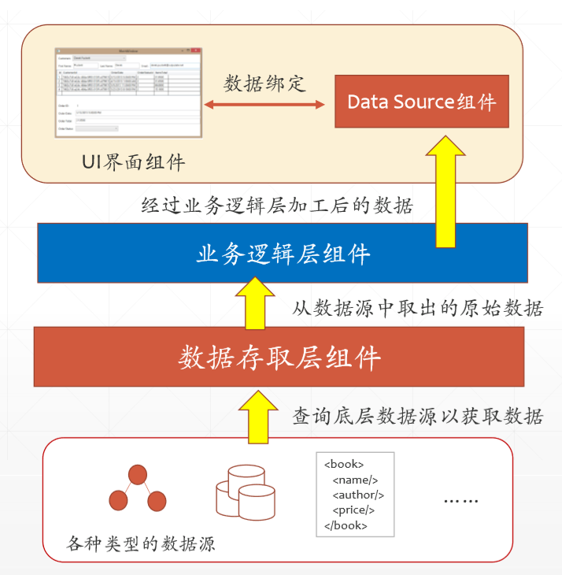

# 人际交往记录簿

[TOC]

## 总体实现思路

- SQL Server存储基本信息  

- Entity Framework连接数据库，自动生成对应类的代码 

- 设计数据存取层实现对数据的访问

- DataSourceBinding组件实现控件与所获取数据的绑定

- 界面UI设计

  

## V1.0(20191123)

### 实现情况

- 实现基本的界面交互
- 实现基础的Person类，Role类，PersonInRole类
- 基于数据库实现Entity Framework绑定
- 实现基础的DataAccessLayer类
- 实现控件的数据绑定

### 实现功能

- 对person类部分属性的增删改查

### 贡献

界面：YMH，LXX

功能：CX

## V2预期

### 总体功能

- 个体信息增删改
- 角色信息增删改
- 社交经历增删改
- 给个体添加角色，社交经历
- 按照个体属性或者角色来查找个体
- 对记录的社交经历进行分析(未定具体功能)
- 纪念日提醒

### 分工(191123——191129)

- [ ] ZZY:完善Role类
- [ ] XXQ:实现给人增添角色
- [ ] LXX:完善Person类
- [ ] CX:社交经历增删改
- [ ] YMH:UI设计改进